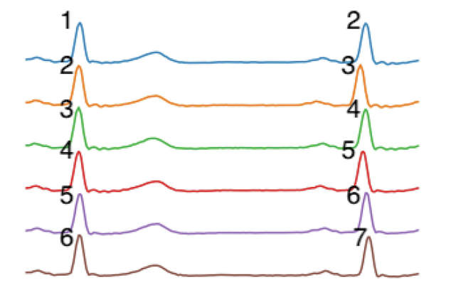
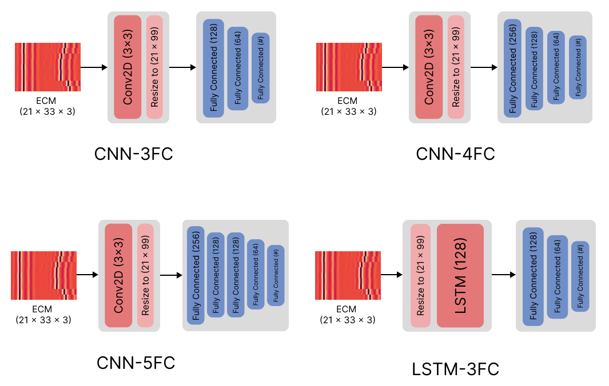

## Content
- [Biometric Authentication with ECG Signal](#biometric-authentication-with-ecg-signal)
- [Electrocardiogram](#electrocardiogram)
- [Electrocardiomatrices](#electrocardiomatrices)
- [Efficient authentication based on ECMs](#efficient-authentication-based-on-ecms)
- [Implementaions & Results](#implementaions--results)
- [Cite us](#cite-us)

## Biometric Authentication with ECG Signal

Biometric authentication uses unique biological traits for identity verification, offering enhanced security over traditional methods. ECG signal-based authentication leverages the unique electrical activity of the heart, with distinct features like heart rate and waveform shape, making it difficult to replicate. This method ensures high security and enables continuous authentication, providing ongoing user verification. ECG-based systems are ideal for applications such as mobile devices and healthcare, offering robust and reliable access control through the unique characteristics of an individual's ECG signal.

## Electrocardiogram

An Electrocardiogram (ECG) measures the heart's electrical activity, producing a waveform with distinct features. The QRST points represent key parts of the heart's cycle: Q (start of ventricular depolarization), R (the highest peak in the ECG, indicating the peak of ventricular depolarization), S (end of ventricular depolarization), and T (ventricular repolarization). The **R peak** is especially significant as it is the most prominent feature in the ECG, crucial for diagnosing heart conditions and useful for biometric authentication due to its unique pattern.

## Electrocardiomatrices

To create an authentication system, we utilized Electrocardiomatrices (ECMs or EKMs). ECMs are heatmaps of a matrix of ECG signals from a user, arranged in a specific manner. Below is an example of an ECM alignment:

<p align="center">
  
</p>

As shown, each row contains two Rpeaks, with the first Rpeak in each row (except the first row) being the last Rpeak of the previous row.

ECMs have a hyperparaeter named beat per frame (bpf) which refers to number of heartbeats (Rpeaks) in each ECM. For example, ECM below is 10 bpf:

<p align="center">
  
</p>

For more details on ECM, refer to the [ELEKTRA: ELEKTRokardiomatrix application to biometric identification with convolutional neural networks][1].

[1]: https://www.sciencedirect.com/science/article/abs/pii/S0925231222009171

You can find the implemetation of ECM at [bpf based implementaion of ECMs][2]

[2]: https://github.com/AmirhosseinSafari/EKMs-creation/tree/master/bpf

## Efficient authentication based on ECMs

Here, we implemented four different deep-learning methods for identification systems that utilize electrocardiomatrices (ECMs). The goal is to create a one-against-all system where the model can accurately identify users based on their ECMs. We tested the robustness of these models across various datasets, including MIT-BIH, NSRDB, and PTBDB, to ensure their applicability in different scenarios. This effort aims to revolutionize user identification by minimizing the number of ECMs required, reducing the burden on users and the system. In essence, we explored different scenarios with various learning models and heartbeat counts to understand their impact on ECM generation, which is crucial for efficient user identification. Additionally, we tested the identification models with different beats per frame (bpfs) rates, and the results confirm that fewer bpfs and ECMs lead to more efficient identification.

<p align="center">
  
</p>

## Implementaions & Results

You can access the implementation code at [Minimum ECMs for authentication][3] and also the plot of results at [plots of results][4]

[3]: https://github.com/AmirhosseinSafari/Minimum_EKMs/blob/master/min%20EKMs%205%20-%2070.ipynb

[4]: https://github.com/AmirhosseinSafari/Minimum_EKMs/blob/master/min%20EKM_final_results.ipynb

Additionally, you can find the results for four different models with 3, 5, 7, and 10 bpf, ranging from 5 to 70 ECMs. The results include accuracy, loss, AUC score, and AUPR metrics, and are organized in appropriately named folders for easy access.

## Cite us!
```
  @INPROCEEDINGS{10874506,
    author={Safari, Amirhossein and Mokhtari, Narges and Hooshmand, Mohsen and Sadeghi, Sadegh and Pahlevani, Peyman},
    booktitle={2024 14th International Conference on Computer and Knowledge Engineering (ICCKE)}, 
    title={Evaluation of Efficient Electrocardiomatrix-Based Identification Using Deep Learning Methods}, 
    year={2024},
    volume={},
    number={},
    pages={076-080},
    keywords={Deep learning;Knowledge engineering;Databases;Convolution;Computational modeling;Biological system modeling;Electrocardiography;Data models;Long short term memory;Testing;User identification;Biometric systems;ECG;ECM;Deep learning},
    doi={10.1109/ICCKE65377.2024.10874506}}
```